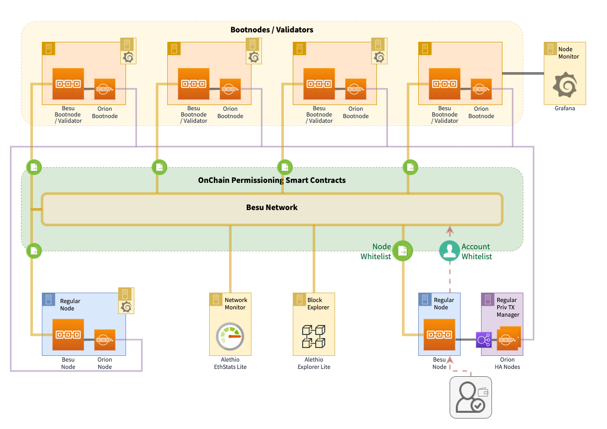

# ALASTRIA Red B

- Visit [What is alastria](https://alastria.io/en/) page to know more about us.

This page contains technical information needed to add a node in the Alastria Besu Network (Alastria Red B)

## System requirements

**Operating System**: Ubuntu 16.04 / 18.04 LTS 64 bits

**Hardware**:

| Hardware       | minimum | desired |
| :------------- | :------ | :------ |
| **CPU's**:     | 2       | 4       |
| **Memory**:    | 4 Gb    | 8 Gb    |
| **Hard Disk**: | 100 Gb  | 1000 Gb |

#### TCP/UDP PORTS

You'll need to open the following ports in both ways to deploy a node:

##### Validator Node

| Port  | Type |      To       | Definition                                   |
| :---: | :--: | :-----------: | :------------------------------------------- |
| 30303 | TCP  |    0.0.0.0    | Ethereum client listener and discovery ports |
| 30303 | UDP  |    0.0.0.0    | Ethereum client listener and discovery ports |
| 8080  | TCP  |    0.0.0.0    | Orion port (private transactions)            |
| 9545  | TCP  | 185.180.8.152 | External Prometheus metrics                  |

##### Regular Node

| Port  | Type |                 To                  | Definition                                   |
| :---: | :--: | :---------------------------------: | :------------------------------------------- |
| 30303 | TCP  |               0.0.0.0               | Ethereum client listener and discovery ports |
| 30303 | UDP  |               0.0.0.0               | Ethereum client listener and discovery ports |
| 8080  | TCP  |               0.0.0.0               | Orion port (private transactions)            |
| 8545  | TCP  | 0.0.0.0 (this can be internal only) | RPC HTTP Port                                |
| 8546  | TCP  | 0.0.0.0 (this can be internal only) | RPC WS Port                                  |
| 9545  | TCP  |            185.180.8.152            | External Prometheus metrics                  |

## Installation & configuration of

### Regular node

Installation of a Regular node (Besu node) using Docker Compose

- [Regular node Installation Guide](docs/regular-node-compose.md)

### Validator node

Installation of a Validator node (Besu node + Orion) using Docker Compose

- [Validator node Installation Guide](docs/validator-node-compose.md)

### Tools - Block Explorer

- [Alethio Lite Explorer Installation Guide](docs/blockexplorer-installation.md)

### Tools - Permissioning DApp

- [Permissioning DApp](docs/permissioning-dapp.md)

# Red B Monitor

- [Red B Network Monitor](https://alastria-netstats2.planisys.net:8443/?orgId=1)
- [Red B Block Explorer - Hosted by Eurogestión](http://5.153.57.78)
- [Red B Permissioning DApp - Hosted by Eurogestión](http://5.153.57.78:3000/)

# Red B Initial Schema (2020-01)

# Annex

- [Description of the Ignition Process (creation of initial Besu & Orion Bootnodes)](docs/ignition-bootnodes.md)
